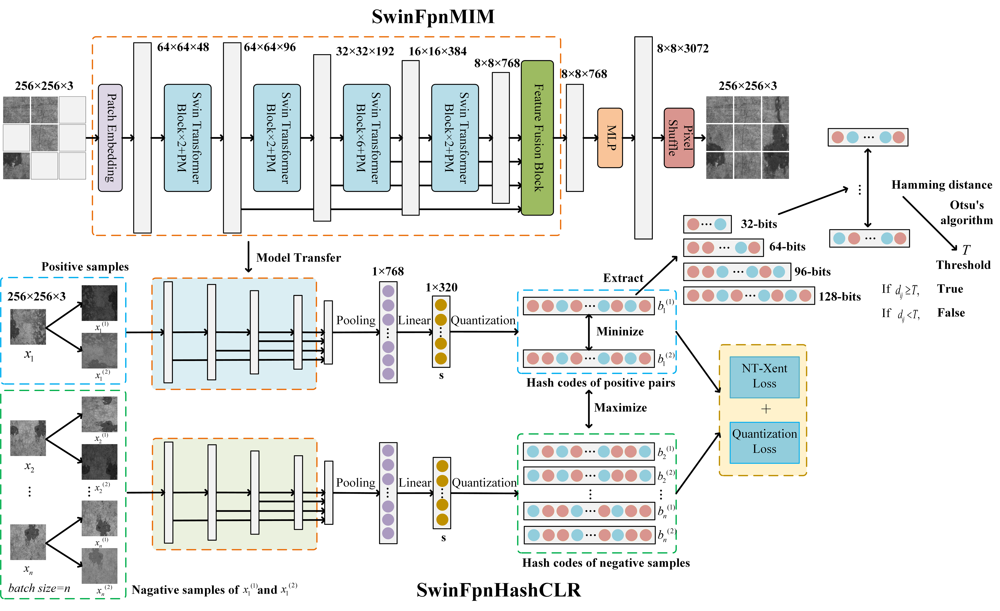
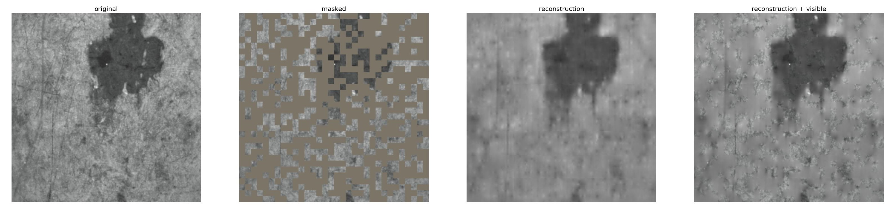

<div align="center">
  <div>&nbsp;</div>
  <div align="center">
    <b><font size="5">Self-supervised Deep Hash Image Deduplication Algorithm for Visual Inspection of Concrete</font></b>
  </div>
</div>


<div align="center">
  <div>&nbsp;</div>
  <div align="center">
   <font size="4"><i>Hao Du, Huifeng Wang*, Yunmei Jiao,  Zefeng Pan, Rong Gao</i></font>
  </div>
</div>

<div align="center">
  <div>&nbsp;</div>
  <div align="center">
    <font size="4">Chang’an University</font>
  </div>
</div>

# Introduction

Concrete visual inspection is crucial for assessing its safety condition. Aiming at the issue of excessive overlap and redundancy of images collected by UAVs or wall-climbing robots during inspection, this research proposed an image deduplication algorithm based on self-supervised deep hashing, where the images are generated into binary hash codes of concrete apparent multi-scale features by **SwinFpnHashCLR**, and efficiently deduplicated between the images is realized by the **hamming distance** and **Otsu's algorithm**. The experiment results indicated that the algorithm proposed in this paper achieved a deduplication rate of 47.73% on the concrete surface dataset, and its effect and robustness were better than the other method. The deep hash deduplication algorithm proposed in this paper can be applied to streamline the dataset for concrete visual inspection, which is of great significance for the efficient stitching of subsequent images, the accurate detection of diseases, and the three-dimensional(3D) reconstruction of bridge piers.




# Main Contributions

- **An innovative deduplication method**

  We propose an efficient deduplication method for concrete surface visual inspection images that, for the first time, integrates self-supervised feature extraction based on masked image modeling with a self-supervised deep hashing algorithm grounded in contrastive learning. This approach enables the efficient and precise removal of duplicate concrete surface images, significantly enhancing the efficiency of inspection data processing.

- **Simultaneously generate different-bit hash codes**

  We design the SwinFpnHashCLR self-supervised deep hashing algorithm, which can simultaneously generate 32-bit, 64-bit, 96-bit, and 128-bit hash codes. This versatility meets diverse detection precision and computational resource requirements and avoids the redundant overhead of training separate hash codes of varying lengths required by traditional hashing methods.

- **Experimental demonstration**

  We investigate the impact of hash code length, masked patch size, and temperature coefficient on deduplication performance. By quantifying the effect of these parameters on the deduplication efficacy of concrete surface images, our work provides robust theoretical support for the cleanup and optimization of redundant data in structural health monitoring.

- **Significant advantages**

  Using hash codes generated by the state-of-the-art (SOTA) SimCLR model as a baseline and conducting comparative experiments with several classical hashing algorithms, we demonstrate the significant advantages of our proposed method regarding hash code generation, deduplication efficiency, and robustness. 

# Installation Tutorial

Our proposed network models SwinFpnMIM and SwinFpnHashCLR were developed under the [MMSelfSup](https://github.com/open-mmlab/mmselfsup) framework.
MMSelfSup depends on [PyTorch](https://pytorch.org/), [MMCV](https://github.com/open-mmlab/mmcv), [MMEngine](https://github.com/open-mmlab/mmengine) and [MMClassification](https://github.com/open-mmlab/mmclassification).

## Prerequisites

In this section, we demonstrate how to prepare an environment with PyTorch.

MMSelfSup works on Linux (Windows and macOS are not officially supported). It requires Python 3.7+, CUDA 9.2+ and PyTorch 1.6+.

```{note}
If you are experienced with PyTorch and have already installed it, just skip this part and jump to the next Installation section. Otherwise, you can follow these steps for the preparation.
```

**Step 0.** Download and install Miniconda from the [official website](https://docs.conda.io/en/latest/miniconda.html).

**Step 1.** Create a conda environment and activate it.

```shell
conda create --name openmmlab python=3.8 -y
conda activate openmmlab
```

**Step 2.** Install PyTorch following [official instructions](https://pytorch.org/get-started/locally/), e.g.

On GPU platforms:

```shell
conda install pytorch torchvision -c pytorch
```

On CPU platforms:

```shell
conda install pytorch torchvision cpuonly -c pytorch
```

## Installation


**Step 0.** Install [MMEngine](https://github.com/open-mmlab/mmengine) and [MMCV](https://github.com/open-mmlab/mmcv) using [MIM](https://github.com/open-mmlab/mim).

```shell
pip install -U openmim
mim install mmengine
mim install 'mmcv>=2.0.0'
```

**Step 1.** Install MMSelfSup.

According to your needs, we support two installation modes:

- [Install from source (Recommended)](#install-from-source): You want to develop your own self-supervised task or new features based on MMSelfSup framework, e.g., adding new datasets or models. And you can use all tools we provided.
- [Install as a Python package](#install-as-a-python-package): You just want to call MMSelfSup's APIs or import MMSelfSup's modules in your project.

#### Install from source

In this case, install mmselfsup from source:

```shell
git clone https://github.com/open-mmlab/mmselfsup.git
cd mmselfsup
pip install -v -e .
# "-v" means verbose, or more output
# "-e" means installing a project in editable mode,
# thus any local modifications made to the code will take effect without reinstallation.
```

#### Install as a Python package

Just install with pip.

```shell
pip install 'mmselfsup>=1.0.0'
```

### Verify the installation

To verify whether MMSelfSup is installed correctly, you can run the following command.

```python
import mmselfsup
print(mmselfsup.__version__)
# Example output: 1.0.0rc0 or newer
```

# Get Quickly Started

- We have provided the data flow required for training images in SwinFpnMIM and SwinFpnHashCLR, which mainly includes model image loading, image preprocessing (such as image augmentation), and other steps. The relevant code is located in the **configs/selfsup/_base_/datasets**.

- We have provided the code for the network architectures of SwinFpnMIM and SwinFpnHashCLR proposed in this study. The relevant code is located in the  **mmselfsup/models/backbones**.

- We modified the loss function of SwinFpnHashCLR and added hyperparameters during the training process. The relevant code is located in the  **mmselfsup/models/algorithms**.

- We have defined the configuration files for the SwinFpnMIM and SwinFpnHashCLR models, which mainly include the model architecture, training strategies, and other settings. The relevant code is located in the **configs/selfsup**.

### Train with a single GPU

```shell
python tools/train.py ${CONFIG_FILE} [optional arguments]
```

A simple example to start training:

```shell
python tools/train.py configs/selfsup/simmim/simmim_swin_tiny_fpn_2xb16-amp-coslr-800e.py
```

### Train with CPU

```shell
export CUDA_VISIBLE_DEVICES=-1
python tools/train.py ${CONFIG_FILE} [optional arguments]
```

**Note**: We do not recommend users to use CPU for training because it is too slow. We support this feature to allow users to debug on machines without GPU for convenience.

### Train with multiple GPUs

```shell
bash tools/dist_train.sh ${CONFIG_FILE} ${GPUS} [optional arguments]
```

Optional arguments:

- `--work-dir`: Indicate your custom work directory to save checkpoints and logs.
- `--resume`: Automatically find the latest checkpoint in your work directory. Or set `--resume ${CHECKPOINT_PATH}` to load the specific checkpoint file.
- `--amp`: Enable automatic-mixed-precision training.
- `--cfg-options`: Setting `--cfg-options` will modify the original configs. For example, setting `--cfg-options randomness.seed=0` will set seed for random number.

An example to start training with 2 GPUs:

```shell
bash tools/dist_train.sh configs/selfsup/simclr/simclr_swin_tiny_fpn_2xb16_coslr_120e.py 2
```


## Visualize Low-level Feature Reconstruction

We provide several reconstruction visualization for SwinFpnMIM algorithms:


Users can run command below to visualize the reconstruction.

```shell
python tools/analysis_tools/visualize_reconstruction.py ${CONFIG_FILE} \
    --checkpoint ${CKPT_PATH} \
    --img-path ${IMAGE_PATH} \
    --out-file ${OUTPUT_PATH}
```

Arguments:

- `CONFIG_FILE`: config file for the pre-trained model.
- `CKPT_PATH`: the path of model's checkpoint.
- `IMAGE_PATH`: the input image path.
- `OUTPUT_PATH`: the output image path, including 4 sub-images.
- `[optional arguments]`: for optional arguments, you can refer to [visualize_reconstruction.py](https://github.com/open-mmlab/mmselfsup/blob/main/tools/analysis_tools/visualize_reconstruction.py)

An example:

```shell
# As for SimMIM, it generates the mask in data pipeline, thus we use '--use-vis-pipeline' to apply 'vis_pipeline' defined in config instead of the pipeline defined in script.
python tools/analysis_tools/visualize_reconstruction.py configs/selfsup/simmim/simmim_swin-large_16xb128-amp-coslr-800e_in1k-192.py \
    --checkpoint https://download.openmmlab.com/mmselfsup/1.x/simmim/simmim_swin-large_16xb128-amp-coslr-800e_in1k-192/simmim_swin-large_16xb128-amp-coslr-800e_in1k-192_20220916-4ad216d3.pth \
    --img-path data/imagenet/val/ILSVRC2012_val_00000003.JPEG \
    --out-file test_simmim.jpg \
    --use-vis-pipeline
```


Results of SimMIM:





# Count Number of Parameters
We provide a script to calculate the number of parameters of the model.

```shell
python tools/analysis_tools/count_parameters.py ${CONFIG_FILE}
```

An example:

```shell
python tools/analysis_tools/count_parameters.py configs/selfsup/simclr/simclr_swin_tiny_fpn_2xb16_coslr_120e.py
```

# Image Deduplication

After the training is completed, the model can be used to perform deduplication on the dataset. We have provided a script file for SwinFpnHashCLR that outputs hash codes and performs deduplication using Hamming distance and the Otsu algorithm.

```shell
python SwinFpnHashCLR_deduplication.py ${CONFIG_FILE} \
    --checkpoint ${CKPT_PATH}
```
An example:
```shell

python SwinFpnHashCLR_deduplication.py configs/selfsup/simclr/simclr_swin_tiny_fpn_2xb16_coslr_120e.py \
    --checkpoint /home/duhaohao/PycharmProjects/mmselfsup-main/mmselfsup-main/checkpoints/epoch.pth
```

We have also provided script files for four image processing methods—aHash, dHash, pHash, and wHash—which output hash codes and perform deduplication using Hamming distance and the Otsu algorithm.
```shell
python image_processing_deduplication.py 
```


## Acknowledgement

Our project is based on [MMSelfSup](https://github.com/open-mmlab/mmselfsup). MMSelfSup is an open source project that is contributed by researchers and engineers from various colleges and companies. We appreciate all the contributors who implement their methods or add new features, as well as users who give valuable feedbacks.
We wish that the toolbox and benchmark could serve the growing research community by providing a flexible toolkit to reimplement existing methods and develop their own new algorithms.


## License

This project is released under the [Apache 2.0 license](LICENSE).

